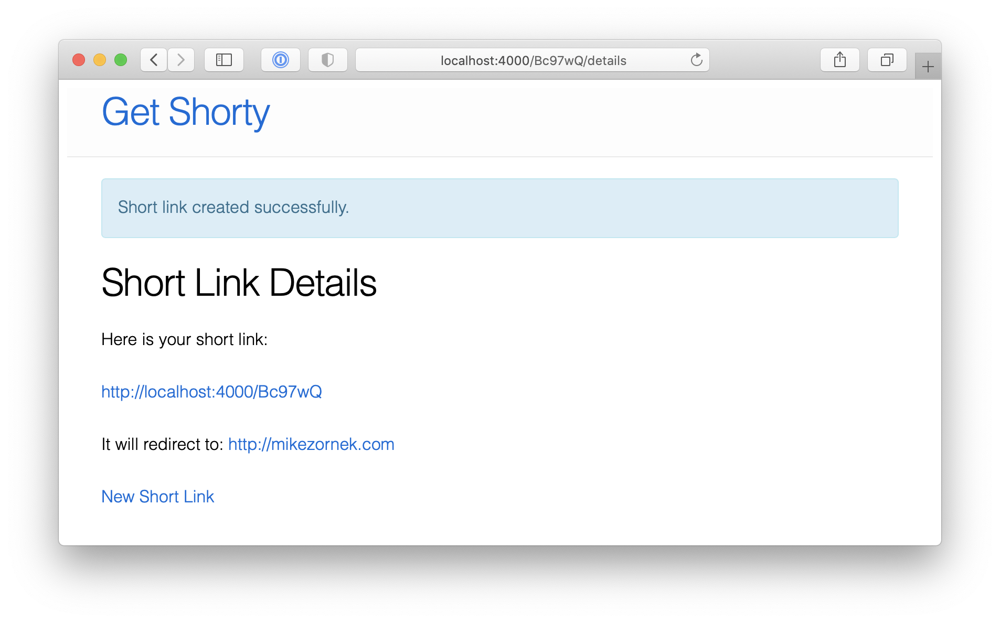

# GetShorty

**GetShorty** is an open source link shortener. It is a member of the Phoenix by Example collection, whose goal is to provide example applications that help frame educational discussions around Elixir and the Phoenix framework. 

Built using Elixir 1.11.1 and Phoenix 1.5.6.

## Preview

Create a new short link:

New short link details:

