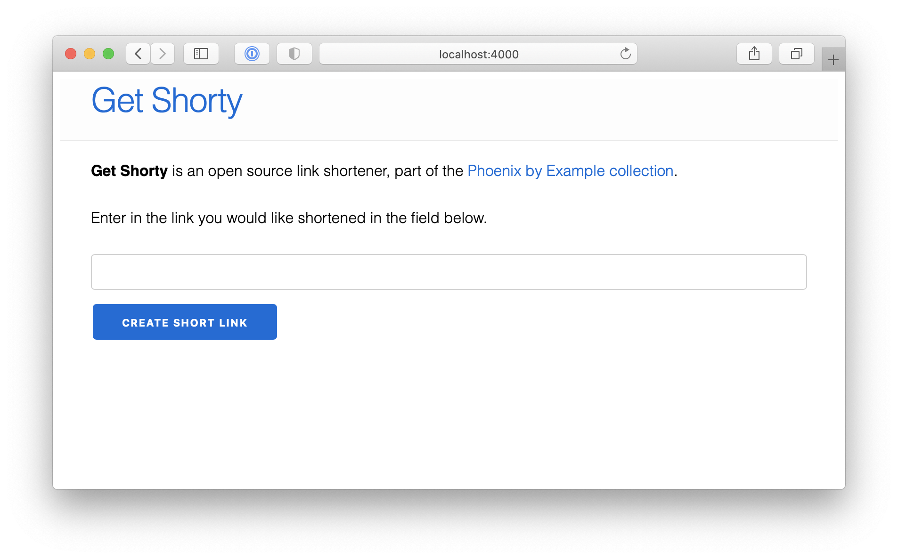

# GetShorty

**GetShorty** is an open source link shortener.

Built using Elixir 1.13.1 and Phoenix 1.6.4.

In the past I used to host this app in production at <https://getshorty.app/> but for now have turned it off to save some money.

## Preview

Create a new short link:

New short link details:

